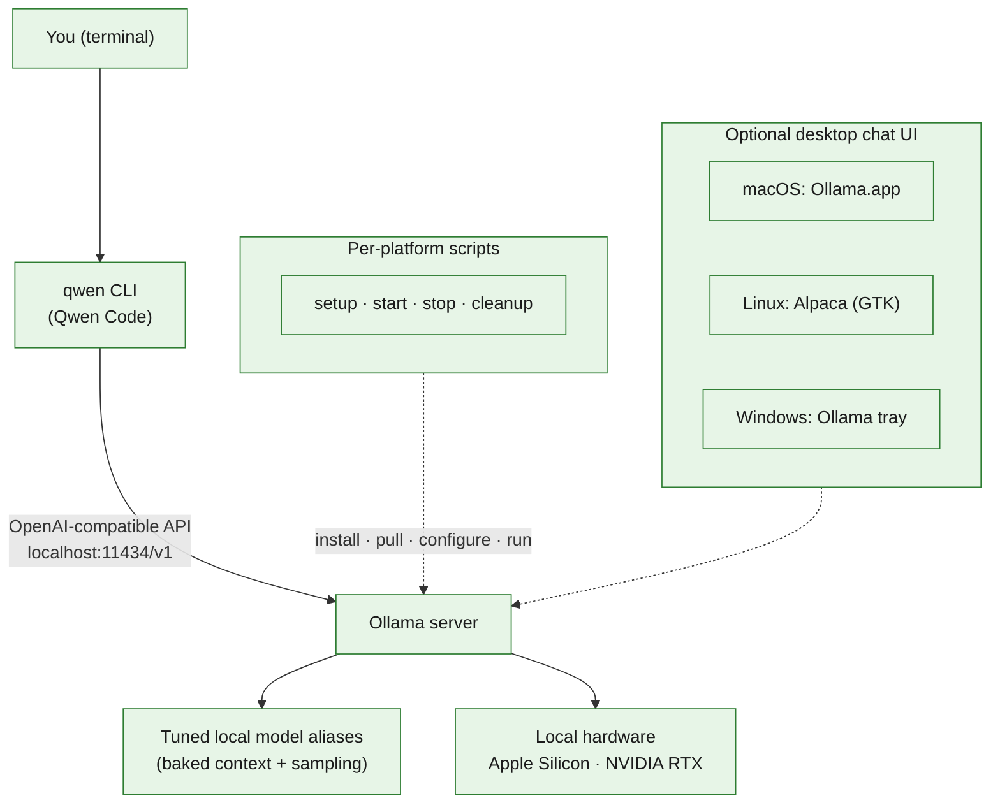

# local-coding-agent

A fully local, offline coding agent. **No cloud, no API keys, no telemetry.**

It wires the [Qwen Code](https://github.com/QwenLM/qwen-code) CLI (`qwen`) to
local models served by [Ollama](https://ollama.com), so agentic coding — edits,
shell commands, tool calls — runs entirely on your machine. Prompts, code, and
model inference never leave `localhost`.

This repository ships tuned setups for three platforms. Each lives in its own
folder with scripts and a focused README:

| Platform | Folder | Target hardware |
|----------|--------|-----------------|
| 🍎 macOS    | [`macos/`](macos/README.md)     | Apple Silicon (tuned for 64 GB) |
| 🐧 Linux    | [`linux/`](linux/README.md)     | Debian/Ubuntu + NVIDIA RTX (~8 GB VRAM) |
| 🪟 Windows  | [`windows/`](windows/README.md) | Windows 11 + NVIDIA RTX (~8 GB VRAM) |

## How it works



Everything in the green graph runs on your machine. The only network access is
during installation and the initial model downloads.

## Core concepts (shared across platforms)

- **Ollama** serves models locally and exposes an OpenAI-compatible endpoint at
  `http://localhost:11434/v1` (Windows uses the explicit IPv4 form
  `http://127.0.0.1:11434`).
- **Qwen Code** (`qwen`) is the agentic CLI. It is pointed at the local Ollama
  endpoint, so no cloud provider or API key is involved.
- **Tuned model aliases.** Each setup pulls base models and creates local
  aliases (e.g. `qcoder`) with a baked-in context window and sampling profile.
  Switch models from inside `qwen` with `/model`. `qcoder` is the default
  everywhere.
- **Memory tuning.** Flash attention and a quantized `q8_0` KV cache are enabled
  so larger context windows fit in limited VRAM:
  ```text
  OLLAMA_FLASH_ATTENTION=1
  OLLAMA_KV_CACHE_TYPE=q8_0
  ```
- **Qwen Code settings.** The installer writes `~/.qwen/settings.json`
  (`%USERPROFILE%\.qwen\settings.json` on Windows) using `jq`-based deep merges
  on Unix, preserving any existing MCP servers, hooks, and unrelated providers,
  and keeping timestamped backups. An `OLLAMA_API_KEY=ollama` placeholder is
  written to satisfy the OpenAI-compatible interface — it is **not** a cloud key.

## Shared script pattern

Every platform exposes the same four core scripts (`.sh` on macOS/Linux,
`.ps1` on Windows):

| Script    | Does |
|-----------|------|
| `setup`   | Installs Ollama, Qwen Code, and dependencies; pulls models; creates tuned aliases; writes Qwen Code settings; validates each model endpoint. |
| `start`   | Starts the Ollama server. `--warm` preloads the default model into memory. |
| `stop`    | Stops Ollama and frees RAM/VRAM. |
| `cleanup` | Removes **all** local Ollama models so you can start fresh (does not uninstall Ollama or Qwen Code). |

Linux and Windows add a few platform-specific helpers (GPU driver install,
GPU health/validation, desktop UI). See each folder's README.

Configuration lives in variables at the top of each script (model names,
contexts, install toggles). The only runtime flag is `--warm` on `start`.

## Models at a glance

| Alias            | macOS (Apple Silicon) | Linux / Windows (RTX 8 GB) | Purpose |
|------------------|-----------------------|----------------------------|---------|
| `qcoder` (default) | `qwen3.6:35b-a3b-coding-mxfp8` | `qwen2.5-coder:7b` | Daily coding driver |
| `qcoder-fast`    | `qwen3.5:4b`          | `qwen2.5-coder:3b`         | Fast/background tasks |
| `qcoder-quality` | `qwen3.6:27b-coding-mxfp8` | —                     | Hard bugs / big refactors (macOS) |
| `qcoder-vision`  | `qwen3.6:35b-a3b`     | —                          | Image input (macOS) |
| `gptoss`         | `gpt-oss:20b`         | —                          | Independent second opinion (macOS) |
| `agentic`        | —                     | `granite4:7b-a1b-h`        | Deterministic tool calling (Linux/Windows) |
| `general`        | —                     | `qwen3.5:4b`               | General chat / reasoning (Linux/Windows) |

Larger macOS models exploit Apple Silicon unified memory; the RTX profiles keep
models ≤ 7B so weights plus KV cache fit in ~8 GB VRAM. Exact aliases and
defaults are documented in each platform README.

## Typical workflow

The shape is identical on every platform — only the script extension and folder
differ:

```text
setup            # one time: install + pull + configure
start --warm     # start Ollama and preload the default model
qwen             # run the agent inside your project
stop             # release RAM/VRAM when done
```

Platform-specific quick starts:

- 🍎 **macOS** → [`macos/README.md`](macos/README.md)
- 🐧 **Linux** → [`linux/README.md`](linux/README.md)
- 🪟 **Windows** → [`windows/README.md`](windows/README.md)

## Editor integration (optional)

Prefer working inside your editor instead of the terminal? Install the official
**[Qwen Code Companion](https://marketplace.visualstudio.com/items?itemName=qwenlm.qwen-code-vscode-ide-companion)**
extension for VS Code (also works with Cursor, Windsurf, and other VS Code-based
editors; also on [Open VSX](https://open-vsx.org/extension/qwenlm/qwen-code-vscode-ide-companion)).

It adds a native Qwen Code chat panel, in-editor diff review with auto-accept,
`@`-mentions for files/images, and multiple sessions — all driven by the same
local Ollama models configured here. Because it runs the bundled Qwen Code with
your local `~/.qwen/settings.json`, inference still stays entirely on
`localhost`. Open it with the Qwen icon in the editor title bar or
`Qwen Code: Open` from the Command Palette.

## Requirements

- One of: macOS (Apple Silicon recommended), Debian/Ubuntu Linux, or Windows 11
- Internet access during installation and model downloads
- `curl` and admin rights (`sudo` / Administrator) for installs
- A supported GPU/accelerator: Apple Silicon, or an NVIDIA RTX GPU (~8 GB VRAM)
  on Linux/Windows
- Enough disk for Ollama plus the selected models (a clean macOS model set needs
  ~110 GB; the RTX profiles are much smaller)

## Privacy

After installation and model downloads, prompts, code, tool calls, and
inference all stay on your machine via Ollama's local API. Qwen Code usage
statistics are disabled in the generated settings.
